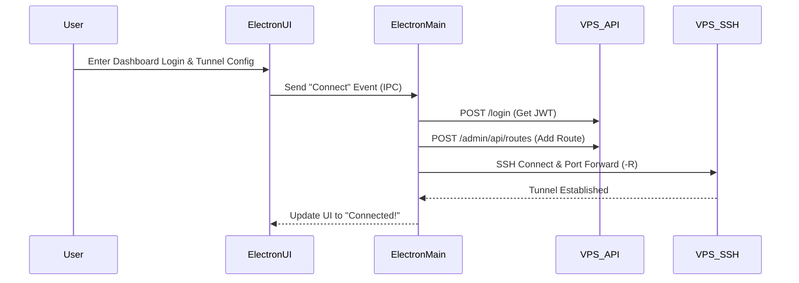

# SPEC.MD: Electron Auto-Tunnel Client

## ✅ Confirmed Requirements & Scope
- **Goal**: Create a lightweight Windows desktop client (`.exe`) that automates connecting local services to the VPS Auth Proxy.
- **Workflow**: User logs into the app, configures a target port (e.g., `1235`) and a VPS path (e.g., `/ai`), and clicks "Connect". The app silently creates a reverse tunnel and updates the VPS routing table.
- **Constraints**: Use Electron, `ssh2` (no external dependencies required on the host Windows machine), and the existing Admin login.

## 🛠 Tech Stack & Dependencies
- **Core**: Electron (Node.js runtime for desktop)
- **UI**: Pure HTML/CSS/JS (Lightweight, vibrant, and premium aesthetic, no React needed for a tiny app)
- **Networking**: 
  - `node-fetch` (or built-in `fetch`) for REST API calls to the VPS.
  - `ssh2` (Native Node.js SSH client) to establish the reverse tunnel without needing `ssh.exe`.

## 📐 Architecture & Data Flow


## 📁 File Structure & Module Breakdown
We will create a new directory `client-app/` inside the project for the Electron codebase:
```
Private_AI/client-app/
├── package.json
├── main.js             # Electron main process (handles ssh2 and API calls)
├── preload.js          # Security bridge between UI and Main process
└── src/
    ├── index.html      # Premium UI dashboard
    ├── style.css       # Animations and vibrant styling
    └── renderer.js     # UI logic (button clicks, IPC messaging)
```

## 🔌 API/DB Schema Changes
- **No changes required on the VPS.** The client will utilize the exact same `POST /login` and `POST /admin/api/routes` REST endpoints we already built.

## 🧪 Testing Strategy
- **Manual Verification**: Run `npm start` in the `client-app` folder. Test logging in, watch for the UI to update, and verify the `ssh2` connection does not crash.
- **Build Verification**: Run `electron-builder` to ensure it successfully packages into an `.exe` file.

## ⚠️ Risks, Edge Cases & Mitigations
1. **Two Passwords Needed**: To make this work seamlessly, the app actually needs *two* layers of authentication:
   - **Layer 1**: The Dashboard `ADMIN_PASSWORD` (to update `routes.json`).
   - **Layer 2**: The VPS `root` password or SSH Key (to establish the `ssh2` tunnel).
   - *Mitigation*: The UI will have fields for VPS IP, VPS Root Password, and Dashboard Password. We will not save these to disk in the first version to ensure maximum security.
2. **Network Drops**: If the user's home internet drops, the tunnel will break.
   - *Mitigation*: The `ssh2` client in `main.js` will listen for the `close` or `error` events and automatically attempt to reconnect every 5 seconds.

## 💡 Proposed Solution Approach & Implementation Steps
1. **Initialize `client-app`**: Run `npm init` and install `electron`, `ssh2`, and `electron-builder`.
2. **Build the UI (`index.html`)**: Design a premium, glassmorphism-style UI with input fields for connection details.
3. **Build the IPC Bridge (`preload.js`)**: Securely pass UI button clicks to the main process.
4. **Implement Tunnel Logic (`main.js`)**: 
   - Write the function to authenticate and POST the route mapping.
   - Write the function to establish the reverse port forward using `ssh2`.
5. **Package**: Configure `electron-builder` to output a `.exe`.
