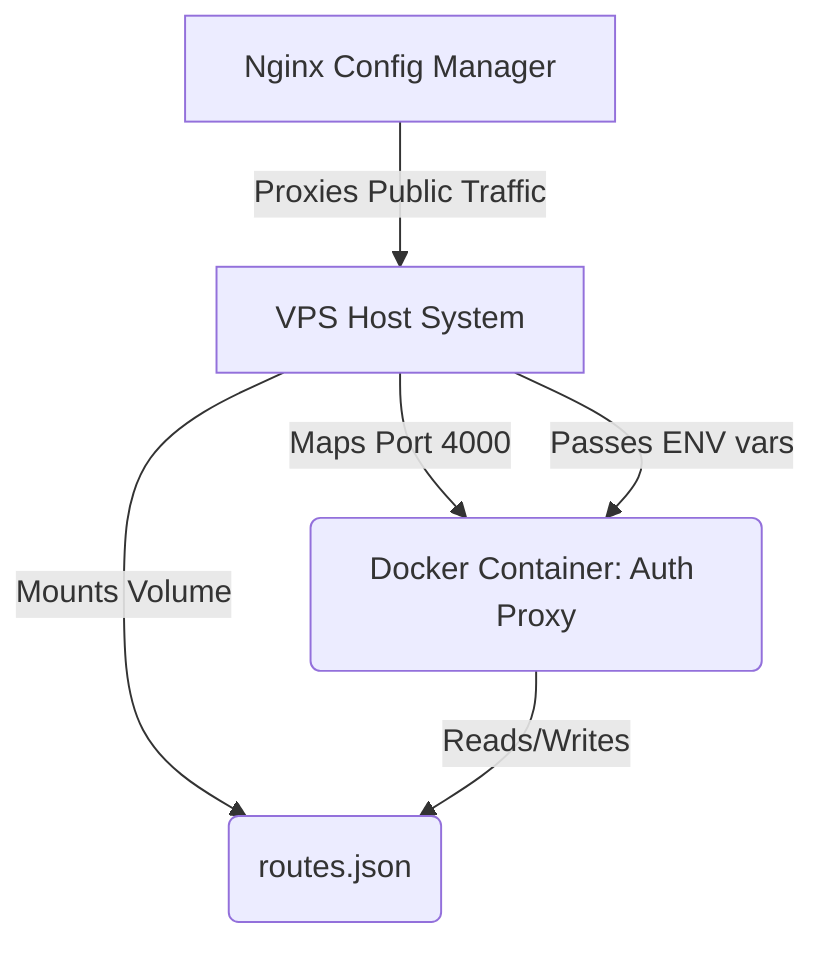

# SPEC.MD: Docker Deployment Strategy

## ✅ Confirmed Requirements & Scope
- **Core Functionality**: Containerize the Auth Proxy Middleware using Docker for seamless deployment on the VPS behind Nginx Config Manager.
- **Persistence**: Ensure `routes.json` is mapped as an external volume so dynamic route changes via the dashboard survive container restarts.
- **Security & Size**: Utilize a multi-stage Docker build with an Alpine Linux base to minimize image size and attack surface.

## 🛠 Tech Stack & Dependencies
- **Base Image**: `node:20-alpine` (lightweight, secure).
- **Build Tool**: `tsc` (TypeScript compiler running in the builder stage).
- **Container Runtime**: Docker.

## 📐 Architecture & Data Flow


## 📁 File Structure & Module Breakdown
The following new files will be created in the project root:
```
Private_AI/
├── Dockerfile           # Multi-stage instructions for building the image
├── .dockerignore        # Excludes node_modules, .env, and local state from the image
└── start-docker.sh      # (Optional) Helper script containing the exact `docker run` command
```

## ⚠️ Risks, Edge Cases & Mitigations
1. **State Loss (routes.json)**: If `routes.json` is baked into the image, any new ports added via the dashboard will be lost when the container updates.
   - *Mitigation*: We will use a Docker volume mount `-v $(pwd)/routes.json:/usr/src/app/routes.json` so the file lives on the VPS host machine.
2. **Environment Variable Exposure**: We must not bake `.env` into the image.
   - *Mitigation*: `.dockerignore` will exclude `.env`. We will pass variables at runtime using `docker run --env-file .env`.
3. **Build Size Bloat**: `node_modules` containing TypeScript and `@types` are massive.
   - *Mitigation*: Stage 1 of the Dockerfile will compile the code. Stage 2 will copy only the compiled `dist/` folder and run `npm install --omit=dev`.

## 💡 Proposed Implementation Steps
1. **Create `.dockerignore`**: To exclude `node_modules`, `dist`, `.env`, and local `routes.json`.
2. **Create `Dockerfile`**: 
   - *Stage 1 (Builder)*: Install all deps, run `npm run build`.
   - *Stage 2 (Production)*: Copy `dist`, install production deps only, expose port 4000, define `CMD ["npm", "start"]`.
3. **Generate Run Command**: Provide the exact `docker build` and `docker run` commands needed to launch it in production.
