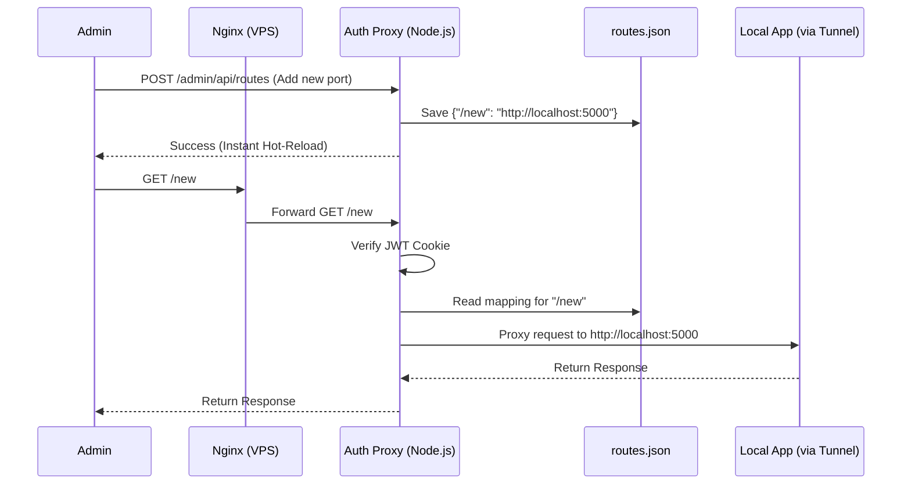

# SPEC.MD: Authenticated Reverse Proxy Middleware & Admin Dashboard

## ✅ Confirmed Requirements & Scope
- **Core Functionality**: A middleware proxy server that authenticates a single admin user via JWT, and routes authorized traffic to specific local ports based on dynamic URL paths.
- **Admin Dashboard**: A secure, server-rendered HTML/JS UI where the admin can view, add, edit, and delete proxy routes.
- **Hot-Reloading**: Changes to proxy routes made in the dashboard take effect instantly without restarting the server.
- **Storage**: Proxy routes are stored persistently in a lightweight `routes.json` file.
- **Location**: Deployed on the VPS alongside Nginx Config Manager.
- **Authentication**: Single hardcoded admin user (username/password) driven by environment variables.

## 🛠 Tech Stack & Dependencies
- **Runtime**: Node.js
- **Language**: TypeScript
- **Web Framework**: Express
- **Core Libraries**: 
  - `http-proxy-middleware` (for proxying and websocket support)
  - `jsonwebtoken` (for issuing and verifying JWTs)
  - `cookie-parser` (to handle JWTs transparently in the browser)
  - `dotenv` (for loading environment variables)

## 📐 Architecture & Data Flow


## 📁 File Structure & Module Breakdown
```
Private_AI/
├── .env                  # Admin Credentials & Server Port
├── routes.json           # Persistent storage for dynamic proxy routes
├── package.json
├── tsconfig.json
└── src/
    ├── index.ts          # Server entry point & global middlewares
    ├── config.ts         # Environment validation
    ├── lib/
    │   └── routeManager.ts # Helper to read/write routes.json instantly
    ├── middleware/
    │   ├── auth.ts       # JWT verification & login redirect logic
    │   └── dynamicProxy.ts # Custom router that checks routes.json and proxies
    ├── routes/
    │   └── admin.ts      # API endpoints for the dashboard (GET/POST/DELETE routes)
    └── views/
        ├── login.html    # Minimalist login UI
        └── dashboard.html # Beautiful UI to manage ports
```

## 🔌 Configuration Schemas

**`.env` File**
```env
PORT=4000
JWT_SECRET=super_secret_random_string
ADMIN_USERNAME=admin
ADMIN_PASSWORD=securepassword
```

**`routes.json` File Structure**
```json
{
  "/ai": "http://localhost:8080",
  "/app": "http://localhost:3000"
}
```

## ⚠️ Risks, Edge Cases & Mitigations
1. **Dynamic Proxy Target Missing**: If a user goes to a path that isn't in `routes.json` (or tries to hit `/`), the server must gracefully return a 404 or redirect to the dashboard, rather than crashing the proxy middleware.
2. **Path Rewriting**: As discussed, we will strip the prefix (`/ai`) when proxying to the target so the local app sees the request at its root `/`.
3. **Admin API Protection**: The `GET /admin`, `POST /admin/api/routes`, etc., MUST be strictly protected by the JWT auth middleware so only the logged-in admin can change routes.

## 💡 Proposed Implementation Steps
1. **Init**: Setup project, TypeScript, and install dependencies.
2. **Storage Layer**: Build `routeManager.ts` to safely read/write `routes.json`.
3. **Auth & Views**: Build the Login UI, Dashboard UI, and JWT authentication middleware.
4. **Admin API**: Build the Express routes for the dashboard to add/remove ports dynamically.
5. **Dynamic Proxy**: Build the custom middleware that intercepts requests, checks `routeManager`, and proxies traffic to the correct local port on the fly.
